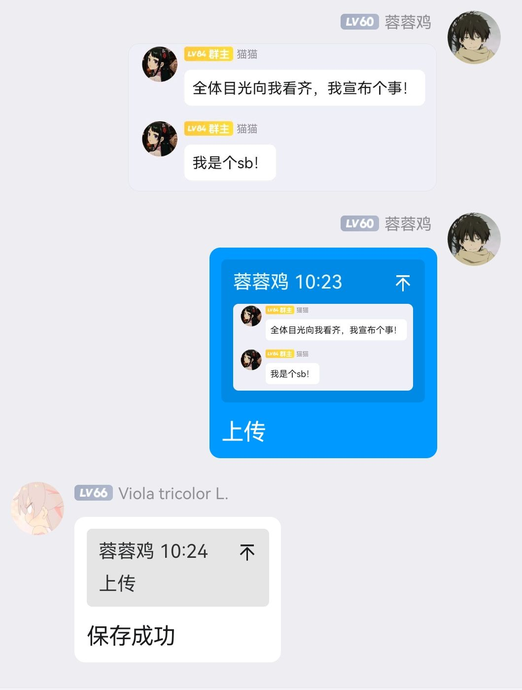

<div align="center">
  
  <br>
  <p></p>
</div>


<div align="center">

# nonebot-plugin-quote

_✨ QQ群聊语录库 ✨_


## 📖 介绍

一款适用于QQ群聊天的语录库插件。

- [x] 上传聊天截图
- [x] 随机投放聊天语录
- [x] 根据关键词投放聊天语录

## 🎉 使用

### 上传

@机器人，发送**上传**指令，开启上传通道。

以图片的形式发送聊天语录，即可将语录上传至语录库中。



### 随机发送语录

@机器人，发送**语录**指令，机器人将从语录库中随机挑选一条语录发送。

### 关键词检索语录

@机器人，发送**语录**+关键词指令，机器人将从语录库中进行查找。若有匹配项，将从匹配项中随机一条发送；若无匹配项，将从整个语录库中随机挑选一条发送。

默认配置下，@机器人加指令即可。


| 指令 | 需要@ | 范围 | 说明 |
|:-----:|:----:|:------:|:-----------:|
| 上传/开始上传/上传开始 | 是 | 群聊 | 开启语录上传通道 |
| 语录上传通道开启后直接发送图片 | 否 | 群聊 | 上传图片至语录库 |
| 语录 + 关键词(可选) | 是 | 群聊 | 根据关键词返回一个符合要求的图片, 没有关键词时随机返回 |


## 💿 安装

### OCR支持

本插件需要使用OCR技术，为了使本插件正常运行，需要使用Docker快速部署OCR服务。

感谢OCR技术支持: https://github.com/alisen39/TrWebOCR

```bash
docker pull mmmz/trwebocr:latest

docker run -itd --rm -p 8089:8089 --name trwebocr mmmz/trwebocr:latest 
```

## ⚙️ 配置

在 nonebot2 项目的 `.env` 文件中添加下表中的必填配置


| 配置项 | 必填 | 默认值 | 说明 |
|:-----:|:----:|:----:|:----:|
| OCR_URL | 否 | 'http://localhost:8089/api/tr-run/' | OCR所需的接口url, 如果你是按照上述命令运行的Docker镜像, 无需额外配置 |
| RECORD_PATH | 是 | 空字符串 | 必要的json文件路径, 示例'/data/record.json' |
| INVERTED_INDEX_PATH | 是 | 空字符串 | 必要的json文件路径, 示例'/data/inverted_index.json' |
| TMP_DIR | 否 | 空字符串 | 临时文件夹路径, 示例'/data/' |

其中，需要在`RECORD_PATH`和`INVERTED_INDEX_PATH`中手动创建两个json文件，并在其中填入`{}`以确保其能够正确运行

